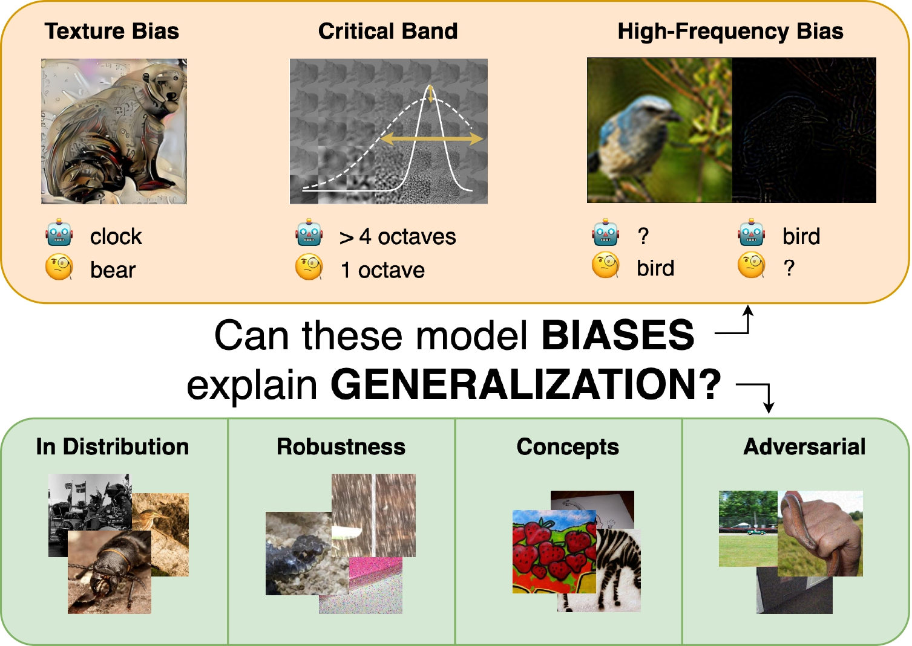

# Can Biases in ImageNet Models Explain Generalization?
Paul Gavrikov and Janis Keuper

[![CC BY-SA 4.0][cc-by-sa-shield]][cc-by-sa]

Presented at: CVPR 2024

[ArXiv](https://arxiv.org/abs/2404.01509) | [Paper](https://openaccess.thecvf.com/content/CVPR2024/html/Gavrikov_Can_Biases_in_ImageNet_Models_Explain_Generalization_CVPR_2024_paper.html) | [HQ Poster](assets/poster.pdf) | [Talk](https://www.youtube.com/watch?v=Xz8l4rxaLmw) 


Abstract: *The robust generalization of models to rare, in-distribution (ID) samples drawn from the long tail of the training distribution and to out-of-training-distribution (OOD) samples is one of the major challenges of current deep learning methods. For image classification, this manifests in the existence of adversarial attacks, the performance drops on distorted images, and a lack of generalization to concepts such as sketches. The current understanding of generalization in neural networks is very limited, but some biases that differentiate models from human vision have been identified and might be causing these limitations. Consequently, several attempts with varying success have been made to reduce these biases during training to improve generalization. We take a step back and sanity-check these attempts. Fixing the architecture to the well-established ResNet-50, we perform a large-scale study on 48 ImageNet models obtained via different training methods to understand how and if these biases - including shape bias, spectral biases, and critical bands - interact with generalization. Our extensive study results reveal that contrary to previous findings, these biases are insufficient to accurately predict the generalization of a model holistically.*


[cc-by-sa]: http://creativecommons.org/licenses/by-sa/4.0/
[cc-by-sa-image]: https://licensebuttons.net/l/by-sa/4.0/88x31.png
[cc-by-sa-shield]: https://img.shields.io/badge/License-CC%20BY--SA%204.0-lightgrey.svg

<p align="center">
  
</p>

## Reproduce our results

You can run the individual benchmarks by calling the corresponding benchmark scripts under `code/eval_*.py`. Please note that most results are synchronized to Weights&Biases (W&B) and not stored locally, so make sure to login into your W&B account.

You must download the datasets yourself and pass the correct path to the scripts. Models are automatically loaded. Please note that some models are stored in Google Drive which may be rate limited at times.

Here is an overview of the scripts and what they test and what dataset they require:

| Script              | Measures | Requires |
| :---------------- | :------ | :---- |
| eval_criticalband.py        |   Criticalband parameters on all ImageNet samples against 1000 classes | ImageNet Validation |
| eval_model_vs_human.py        |   Measures Shape Bias and stylized ImageNet and other OOD accuracy (not used in this paper). | Automatically loades Datasets |
| eval_spectral.py        |   Performance on bandpass filtered Images (Spectral Bias). | ImageNet Validation |
| eval_imagenet_adv.py           |   Evaluation of adversarial attacks (PGD).   | ImageNet Validation |
| eval_imagenet_c.py    |  Robustness against Common Corruptions (ImageNet-C).   | ImageNet-C |
| eval_imagenet_cbar.py    |  Robustness against ImageNet-Cbar.   | ImageNet-Cbar |
| eval_imagenet_ood.py    |  Various dataset benchmarks including ImageNet Validation/A/R/Sketch/v2*.   | ImageNet Validation/A/R/Sketch/v2 |
| eval_imagenet_real.py    |  In-distribution validation on ImageNet-ReaL.   | ImageNet-ReaL |
| eval_imagenet.py    |  Default ImageNet validation (also included in eval_imagenet_ood).   | ImageNet Validation|

Please follow instructions for the datasets: 
[ImageNet](https://www.image-net.org/download.php), [ImageNet-C](https://github.com/hendrycks/robustness), [ImageNet-Cbar](https://github.com/facebookresearch/augmentation-corruption), [ImageNet-A](https://github.com/hendrycks/natural-adv-examples), [ImageNet-R](https://github.com/hendrycks/imagenet-r), [ImageNet-Sketch](https://github.com/HaohanWang/ImageNet-Sketch), [ImageNet-v2*](https://github.com/modestyachts/ImageNetV2).

For ImagNet-ReaL place [real.json](https://github.com/google-research/reassessed-imagenet/blob/master/real.json) into your ImageNet root.

\* Please run code/fix_inv2.py before running benchmarks.


### Raw results and visualizations
Please check [raw-data/benchmark.csv](raw-data/benchmark.csv) for all obtained benchmarks. We also provide a notebook in [code/plots.ipynb]/(code/plots.ipynb) showing how to handle the data to replicate our plots.

## Citation 

If you find our work useful in your research, please consider citing:

```
@InProceedings{Gavrikov_2024_CVPR,
    author    = {Gavrikov, Paul and Keuper, Janis},
    title     = {Can Biases in ImageNet Models Explain Generalization?},
    booktitle = {Proceedings of the IEEE/CVF Conference on Computer Vision and Pattern Recognition (CVPR)},
    month     = {June},
    year      = {2024},
    pages     = {22184-22194}
}
```

### Legal
This work is licensed under a
[Creative Commons Attribution-ShareAlike 4.0 International License][cc-by-sa].
